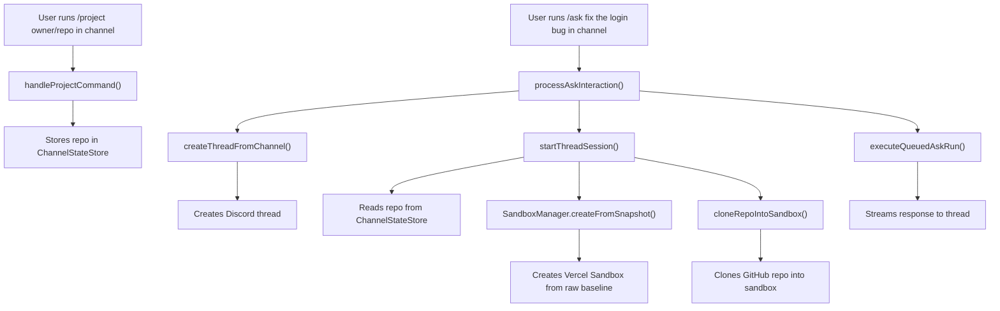

# Thread Creation Flow

Thread creation happens in `api/discord/interactions.ts`.

## Commands

### `/project <repo> [branch]`

Sets the GitHub repository for the current channel. This persists in `ChannelStateStore`.

- `repo`: GitHub repo in `owner/repo` format or full URL
- `branch`: Optional branch name (default: `main`)

### `/ask <prompt>` (required)

Sends a coding request to the agent. If no session exists, automatically creates a thread and sandbox.

## Functions

### `createThreadFromChannel()` (lines 1223-1250)

Creates a private Discord thread with `auto_archive_duration: 1440` (24 hours).

```typescript
POST /channels/{channelId}/threads
```

### `startThreadSession()` (lines 1252-1296)

1. Creates or resumes a sandbox via `SandboxManager.getOrCreate()`
2. Stores sandbox context in `ThreadRuntimeStore`
3. Clones the GitHub repo (if set via `/project`) into the sandbox

### `handleProjectCommand()` (lines 1254-1281)

When `/project` is run in a channel:

1. Parses the repo URL
2. Stores repo and branch in `ChannelStateStore` for the channel

### `processAskInteraction()` (lines 2282-2357)

When `/ask` is run in a channel:

1. Reads the repo from `ChannelStateStore` for the channel
2. If no session exists, creates a new thread and sandbox with the repo cloned
3. Streams the prompt response to Discord via `executeQueuedAskRun()`

## Flow Diagram



## No Empty Sandbox Mode

Unlike the previous design, there is no empty sandbox mode. The sandbox is always created with the repo cloned (if set via `/project`). If no repo is set, a raw baseline snapshot is used without cloning.

## Prompt Required

`/ask` requires a prompt - it cannot be used without one. Set the repo first with `/project`, then use `/ask` to code.
